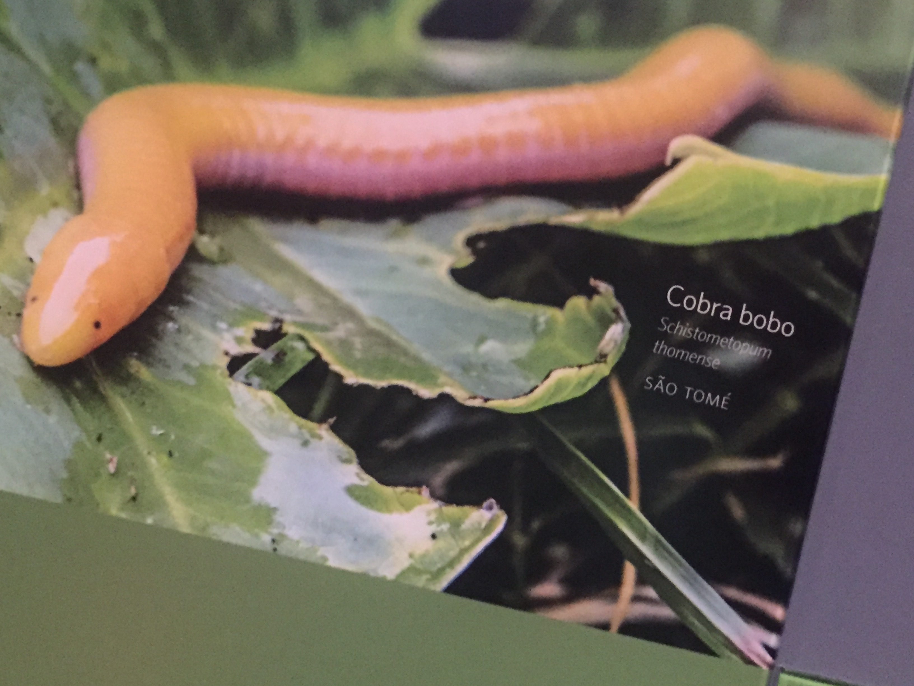

#####a.l.: Capstone for DEI

[Track Project Progress -> Trello](https://trello.com/b/dA5mU1LV/travel-recommender-cobra-bobo)
[Project Presentation -> Google Slides](https://docs.google.com/presentation/d/1-F59uymNAmPcRsGmusw871SlWFFBmF2Le3mFfOiDNkA/edit?usp=sharing)

##Schistometopum Thomense 

<!-- 

	

 -->

_[wikipedia - Schistometopum Thomense ](https://en.wikipedia.org/wiki/Schistometopum_thomense)_
is a species of amphibian in the family Dermophiidae, endemic to São Tomé and Ilhéu das Rolas.It is found in most soils on São Tomé, from tropical moist lowland forests to coastal coconut plantations. It is absent only from the driest northern areas of the island. It is typically around 30 cm (12 in) in length, and is often bright yellow. This species may be referred to as the **São Tomé caecilian** (with various spellings of the island's name), as the **Aqua Ize caecilian**, or as the **island caecilian**, or by the local name of **cobra bobo**. If you managed to read the paragraph above, and all the long-word location all the jargons made sense to you, just so you know that I am VERY impressed! It's not relevant to the project AT ALL. So here is the project:

###Project Inspiration
My friend and I were planning a road trip, we have a specific, but also blurry idea that we want to go on a **roadtrip** to some **State/National Parks** between our locations **WA, OR, North CA** to spend **a few days in Sept or Oct** to enjoy nature. We are both travellers and the parks has to be where none of us has been to. How do we start planning the trip?
#####Method 1: 
List all the given the query and... you guessed it... Google it! There, Google returned a lot of blogs, articles. It is not very efficient to find matching places at first sight -- we have to read through all the travel blogs, really dig into the lines, putting all puzzles together to come up with a plan.
#####Method 2:
Start again with Google Map. Then search for national and state parks in the area. Choose a few that is within the desired travel parameter, then filter to get the final travel plan by searching each park individually. 

#####As a non-native English speaker and a lazy reader ( argument: world is made a better place by lazy people? ), therefore [I](http://azzurolilc.github.io/) came up with the idea to build a real-time fuzzy (and personalized) search engine for providing travel destinations suggestions!

###Project Features

###Challenge
Discreet words and categories, semantic understanding would be better than traditional NLP.
Count Based: GloVe
Prediction Based: word2vec

###Core Architecture
Data collection and : data indexing and feature extraction.
Modeling: Neural Network
Realtime: Query and search algorithm.

Also see: [IMG](https://sketchboard.me/nzWpMwOjWTrD)

###Data Source
Language Classifier Modeling:
	Common Crawl [April 2016](http://commoncrawl.org/2016/05/april-2016-crawl-archive-now-available/) - 
	TripAdvisor
	LonelyPlanet
	Travbuddy

User Search:
	Query
	UI Log
	History

###NLP and Proximity Search
<!-- OpenNLP, Solr?(Lucene?) query parser? -->
steming - remove some capitaized words - word2vec

###Linguistic Modeling

###Why train a model for this task?
There are options for existing models: [GloVe](http://nlp.stanford.edu/projects/glove/)
So why spend the time wotk on a differnt one?
1. NLP is fun! And getting to work with text/search/ML is more so.
2. Optimazied for Precision: Only concentrate on word meaning in the given field. Avoid word ambiguity, for a more accurate model. (for all positive, filter out false resident in non-related documents)
3. Optimized for Recall: (for all related documents, improve retrieved rate)
4. Because I can, with enough data from the travel sites, I have enough data to build my own model.

#####List of Dictionaries - word2vec approach

UNK - Uncommon Words, not in dictionary

#####Skip-gram Model

For this project, I choose to use 7 skip-gram. 

#####Dictionary 

###Evaluation
Search result and user log
*Rating

###System Infrustructure

Data comes from Common Crawl S3, cleaned, formated and saved to CFS.
Spark read in data from CFS, process with MlLib word2vec and save the model to web server.

User logs sink to Kafka and processed with Spark Streaming.
Play framework servers the query result to web UI. 

###Configuration and Instruction

TBD

###Resources

#####Neural Network & NLP

[DL4J:word2vec](http://deeplearning4j.org/word2vec)

[UNDERSTANDING CONVOLUTIONAL NEURAL NETWORKS FOR NLP](http://www.wildml.com/2015/11/understanding-convolutional-neural-networks-for-nlp/)

[Stanford CS224d: Deep Learning for Natural Language Processing](http://cs224d.stanford.edu/syllabus.html)
[Lectures](https://www.youtube.com/playlist?list=PLmImxx8Char9Ig0ZHSyTqGsdhb9weEGam)

[Better Word Representations with Recursive Neural Networks for Morphology](http://nlp.stanford.edu/~lmthang/data/papers/conll13_morpho.pdf)

[IMPLEMENTING A CNN FOR TEXT CLASSIFICATION IN TENSORFLOW](http://www.wildml.com/2015/12/implementing-a-cnn-for-text-classification-in-tensorflow/)

